# ToDoList API

Este projeto é uma **API REST simples para uma aplicação de lista de tarefas (ToDo List)**, desenvolvida com **Spring
Boot**.  
A aplicação permite o gerenciamento de **usuários** e suas **tarefas**, utilizando relacionamento 1:N (um para muitos)
no banco de dados.

---

## Tecnologias Utilizadas

- **Java**
- **Spring Boot**
- **Spring Web**
- **Spring Data JPA**
- **Validation**
- **Lombok**
- **MySQL Driver**
- **Spring DevTools**

---

## Estrutura do Projeto

O sistema é dividido principalmente em duas entidades:

- **Usuário**
- **Tarefa**

A lógica do banco de dados é baseada no seguinte conceito:

> 🔹 Um **usuário** pode possuir **várias tarefas**  
> 🔹 Uma **tarefa** pertence a **apenas um usuário**

---

## Relacionamento 1:N (Um para Muitos)

### Lógica do Relacionamento

O relacionamento **1:N** é aplicado da entidade **Usuário → Tarefa**, onde:

- Um usuário pode ter várias tarefas
- Cada tarefa está vinculada a somente um usuário

Esse relacionamento é implementado utilizando anotações do **JPA (Jakarta Persistence API)**.

---

## Entidade Usuário

```java

@OneToMany(mappedBy = "usuario", cascade = CascadeType.ALL)
private List<Tarefa> tarefas = new ArrayList<>();
```

### Explicação

- No **Usuário** é utilizado o `@OneToMany`, indicando que um usuário pode possuir várias tarefas.
- O atributo `cascade = CascadeType.ALL` garante que, ao excluir um usuário, **todas as suas tarefas também serão
  removidas**.
- A lista `List<Tarefa>` é responsável por armazenar todas as tarefas vinculadas ao usuário.

---

## Entidade Tarefa

```java

@ManyToOne
@JoinColumn(name = "usuario_id")
private Usuario usuario;
```

### Explicação

- Na entidade **Tarefa** é utilizado o `@ManyToOne`, que representa o inverso do `@OneToMany`.
- O `@JoinColumn(name = "usuario_id")` cria a **chave estrangeira** `usuario_id` na tabela de tarefas.
- A variável `usuario` armazena o usuário ao qual a tarefa pertence.

---

## Imagens do Projeto testando endpoints

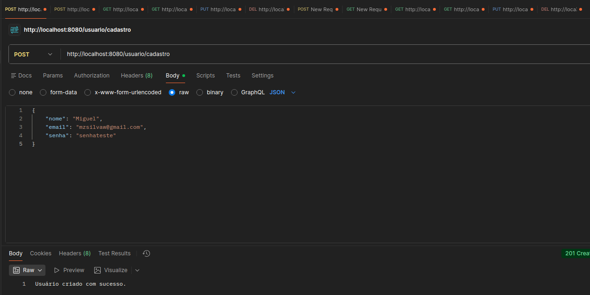
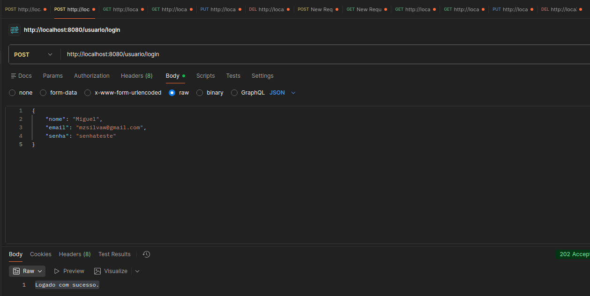
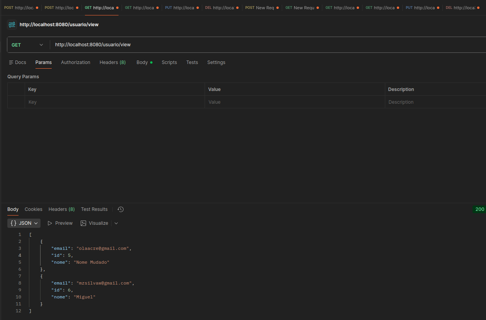
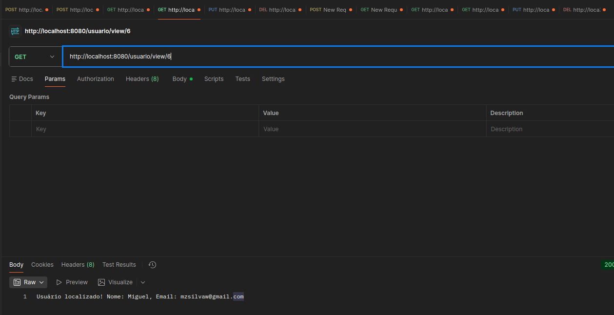
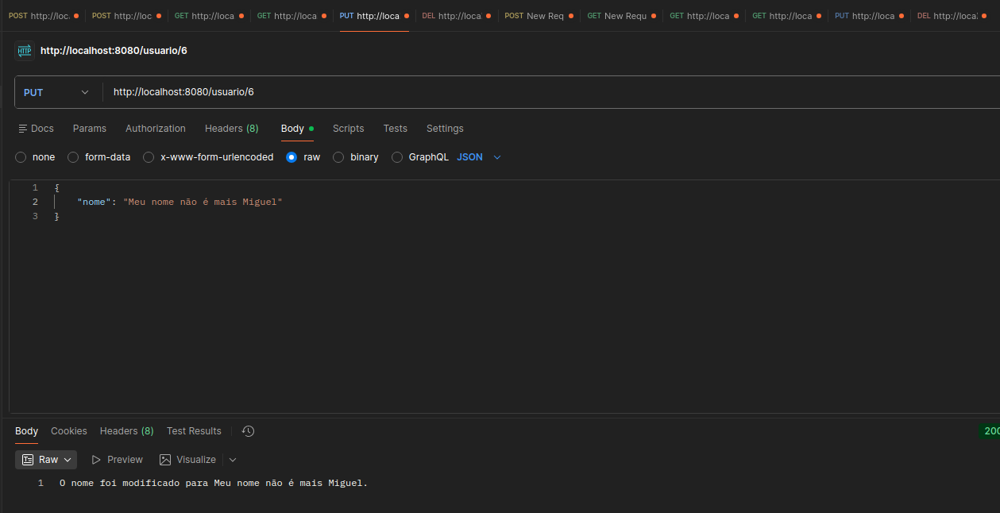
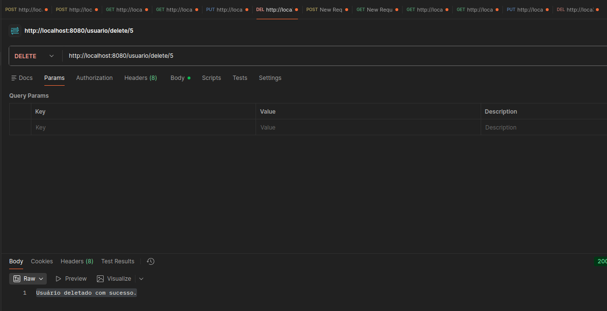
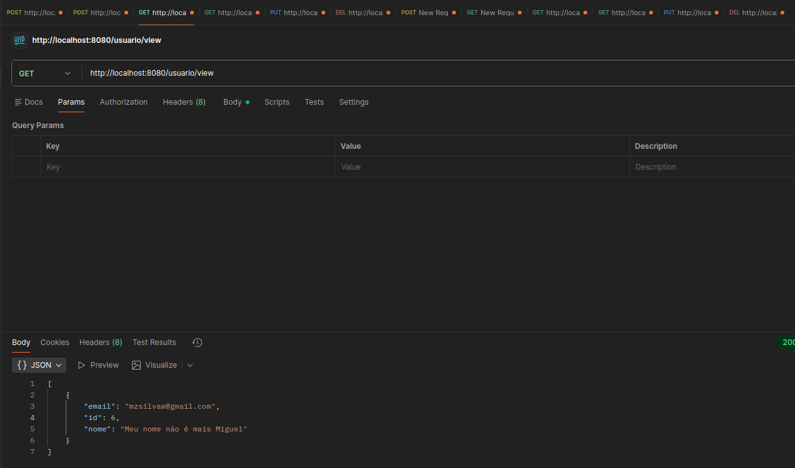
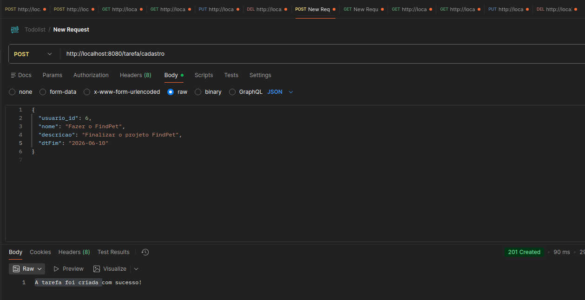
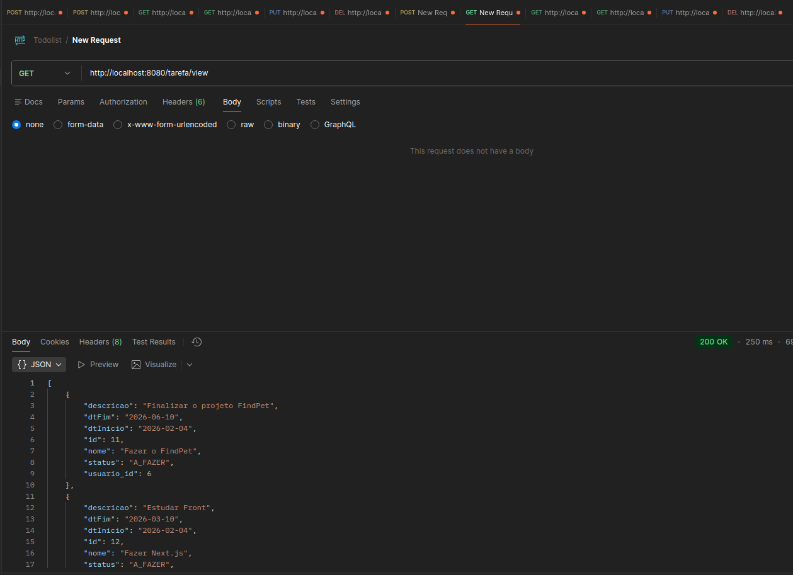
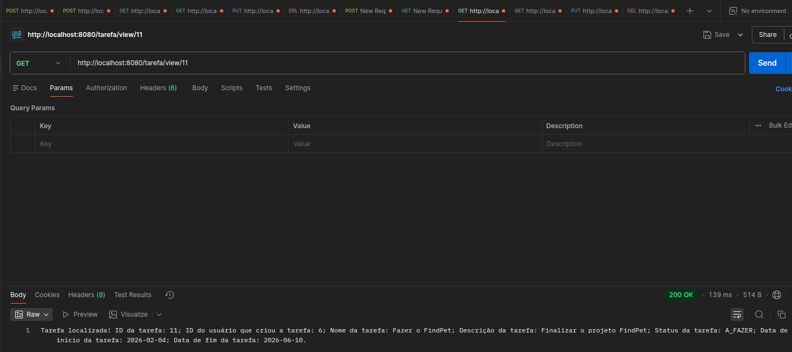
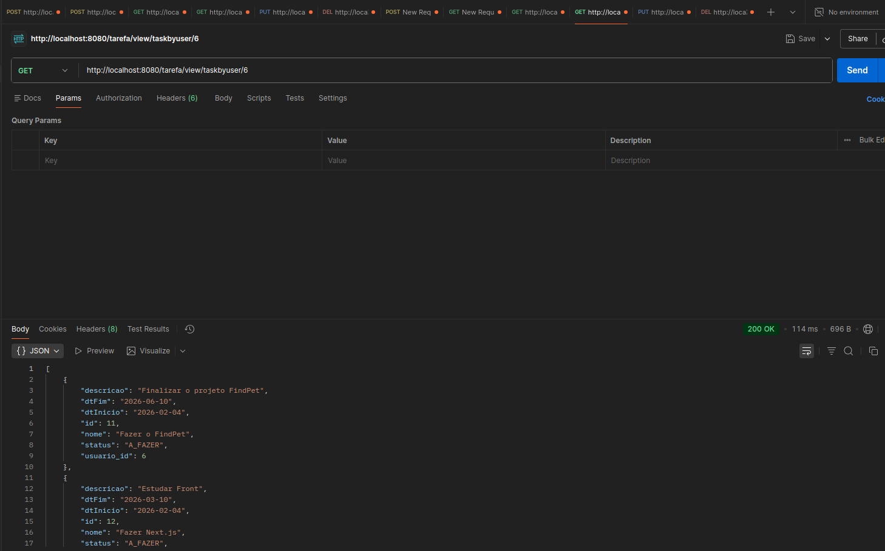
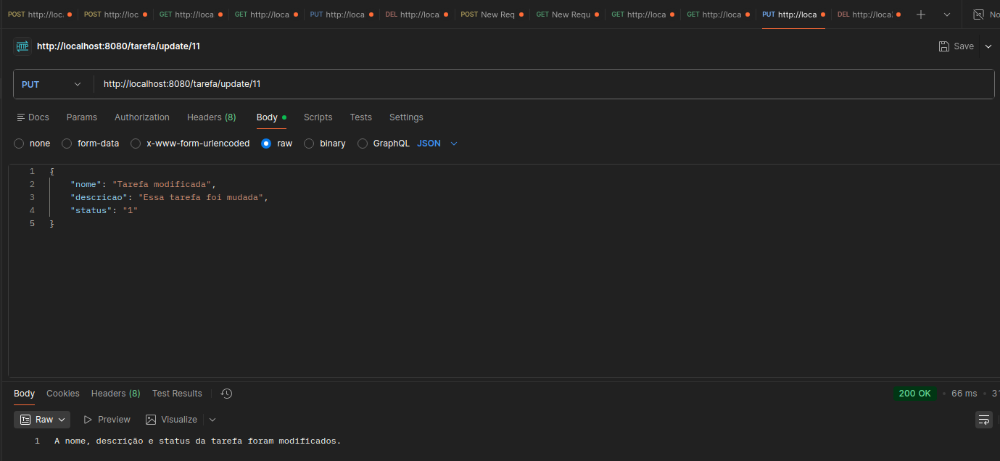
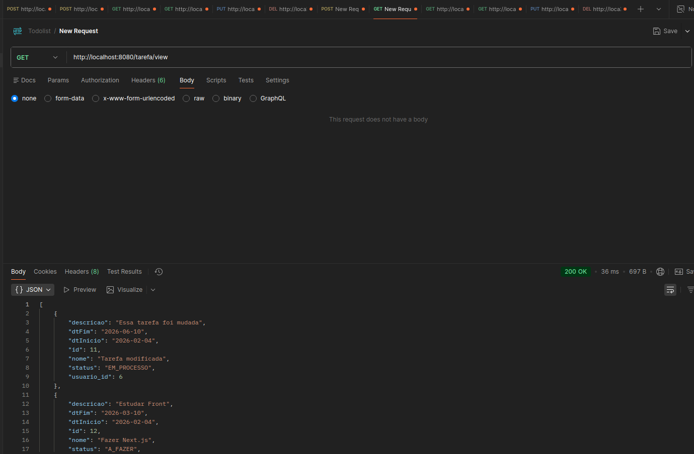
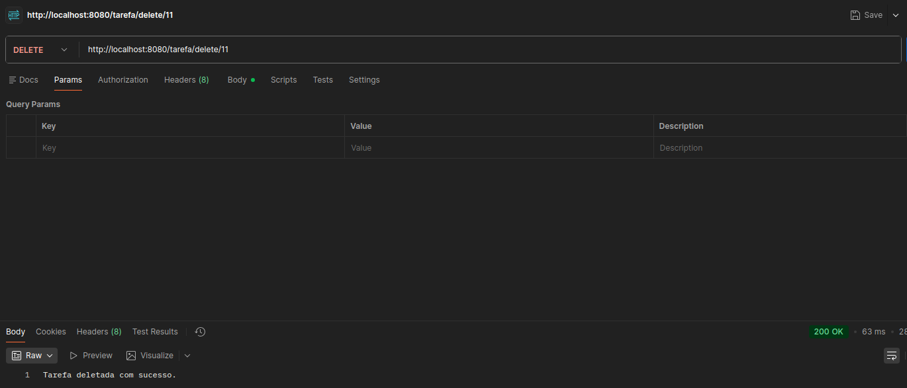
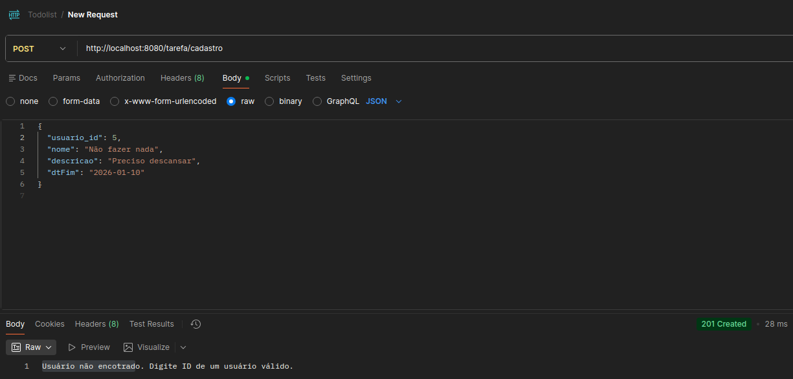